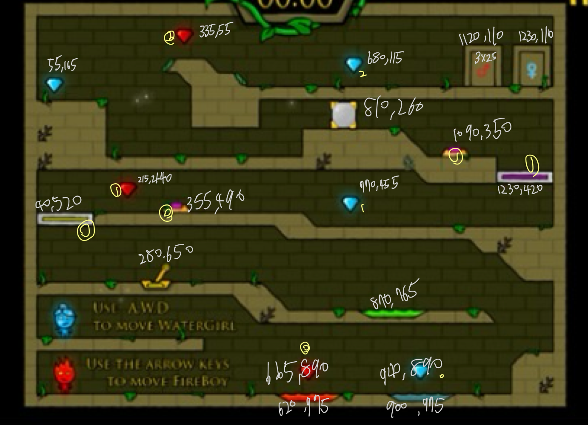
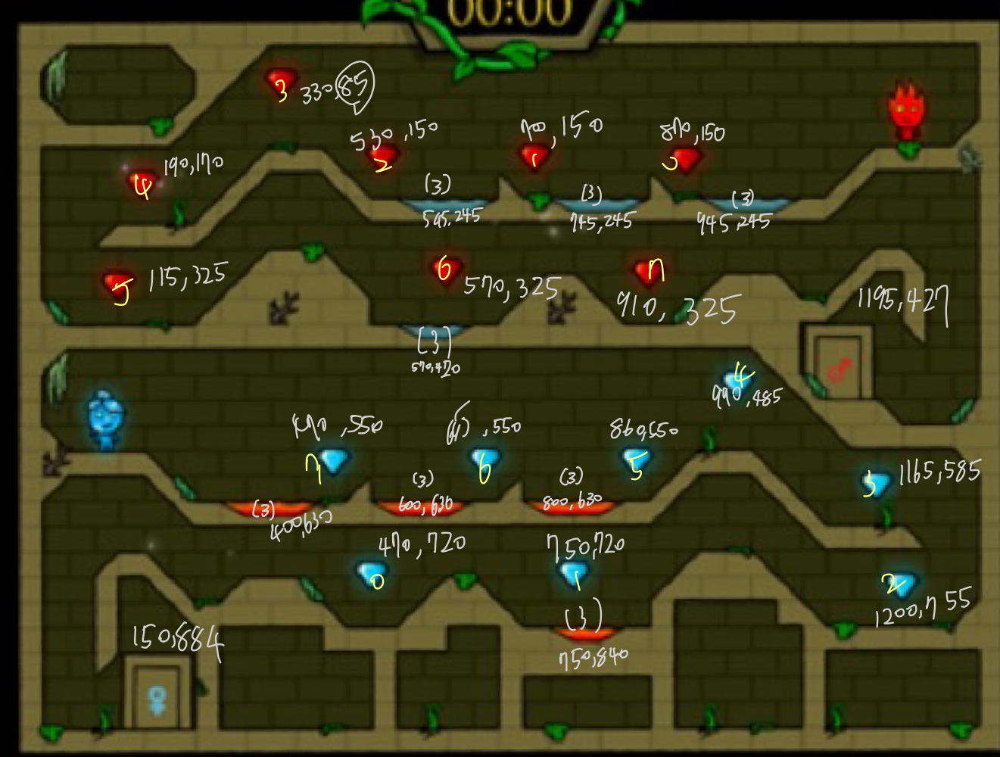
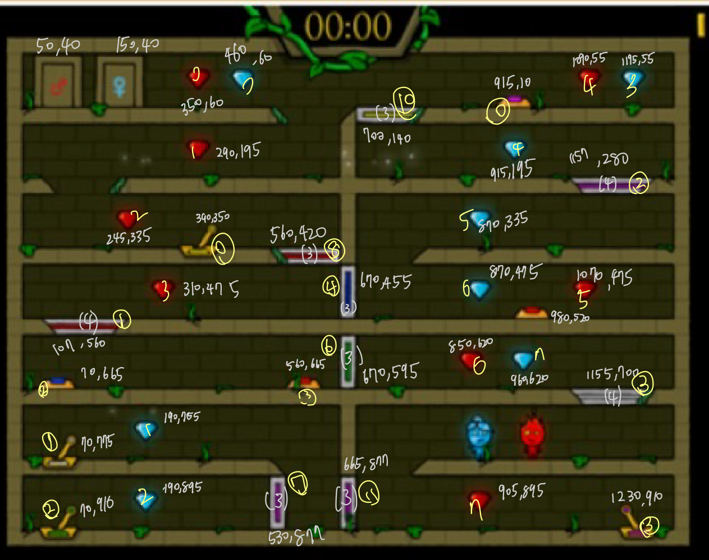
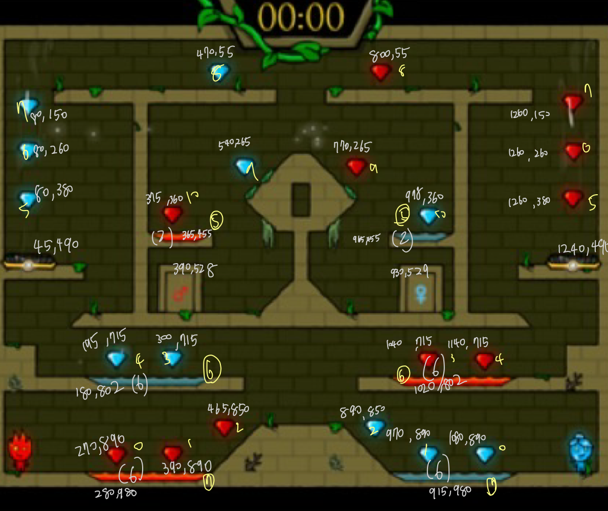
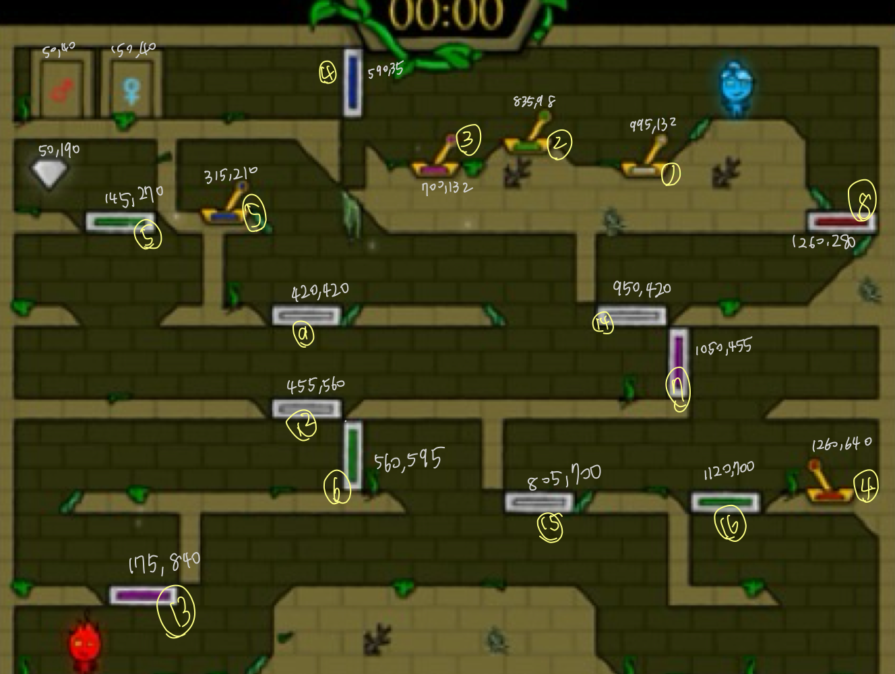

# ObjectOrientedProgrammingLab
## 更新日誌
2024/03/04 initial project & add part of image  
2024/03/14 add "Right/Left move and initial Jump move"   
2024/03/15 add "class of Fireman, Watergirl and Character"  
2024/03/17 add "use text file to generate map"  
2024/04/30 finish level One

## Resources
原網頁版本 
url : https://i-gamer.net/site/16086.html

Virtual Key Code
url : https://learn.microsoft.com/zh-tw/windows/win32/inputdev/virtual-key-codes

Library
url : https://ntut-xuan.github.io/LeistungsstarkesGameFramework  

## 每周進度
|  週數   |  成員1 Eva  |   Done   | 成員2 Bryan|Done|
|  :---:  |   :---:    | :---:    | :---:    | :---:    |
|Week2    |確認題目/找素材| &#10004; |確定題目/找素材| &#10004; |
|Week3    |關卡地圖製作1| &#10004; |人物移動-左右| &#10004; |
|Week4    |關卡地圖製作1| &#10004; |人物移動-重力| &#10004; |
|Week5    |主畫面製作| &#10004; |人物移動-重力| &#10004; |
|Week6    |關卡選擇畫面製作| [ ] |關卡地圖製作-判定| &#10004; |
|Week7    |死亡視窗| [ ] |關卡機關製作-冰/火門| &#10004; |
|Week8    |過關視窗| [ ] |關卡機關製作-鑽石| &#10004; |
|Week9    |暫停畫面| [ ] |關卡機關製作-水/火/綠池| [ ] |
|Week10   |各畫面連接|  &#10004;  |關卡機關製作-移動桿按鈕| [ ] |
|Week11   |關卡地圖製作2|  &#10004;  |關卡機關製作-風扇| [ ] |
|Week12   |關卡地圖製作3|  &#10004;  |關卡機關製作-方塊| [ ] |
|Week13   |關卡地圖製作4|  &#10004;  |關卡機關與地圖整合| [ ] |
|Week14   |Demo| [ ] |Demo| [ ] |
|Week15   |Demo| [ ] |Demo| [ ] |
|Week16   |Demo| [ ] |Demo| [ ] |
|Week17   |報告製作| [ ] |報告製作| [ ] |

## 各個關卡待修的小Bug
### 第一關
- [ ] 跳躍時左右撞牆判定
- [ ] 箱子推到底時，角色應該也要停下
- [ ] 升降梯頂頭判斷有小問題

---

### 各地圖座標圖
###### 黃筆為各物件在陣列中的index  
**Map1**
|   物件  |   總數   | 
|  :---:  |  ---  |
|Button   |    2    |
|Controller|   1    |
|Pole     |    2    |
|Pool     |  1,1,1  |
|Diamond  |  3,3,3  | 
|Box      |    1    | 

**Map2**
|   物件  |   總數   | 
|  :---:  |  ---  |
|Pool     |  4,4,0  |
|Diamond  |  8,8,0  | 

**Map3**
|   物件  |   總數   | 
|  :---:  |  ---  |
|Button   |    3    |
|Controller|   4    |
|Pole     |    9    |
|Diamond  |  8,8,0  | 

**Map4**
|   物件  |    總數    | 
|  :---:  |    ---    |
|Pool     |   3,3,0   |
|Diamond  |  11,11,0  | 
|Fan      |     2     | 

**Map5**
|   物件  |    總數    | 
|  :---:  |    ---    |
|Controller|    5     |
|Pole     |    11     |
|Diamond  |   0,0,1   | 

### Make the Map.txt 更改地圖文字檔
資料夾中有 mapSample.txt 為 40 * 29 的地圖基礎外框  
再依要放的物件去更改編號